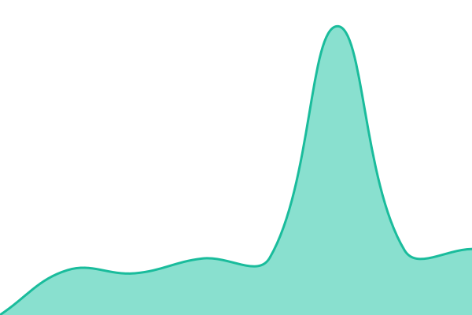
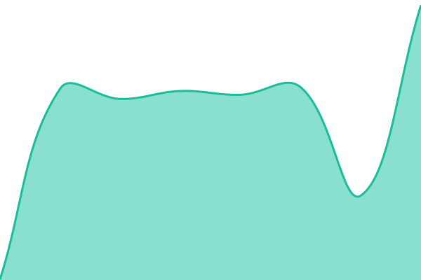
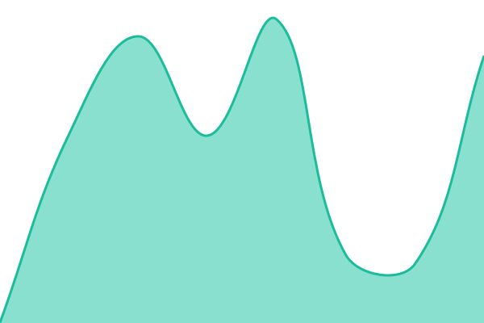
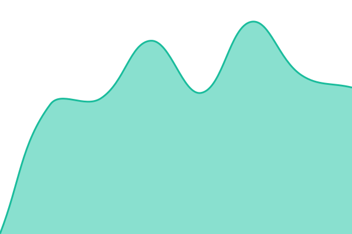

# [📈 Live Status](https://tjorim.github.io/upptime): <!--live status--> **🟧 Partial outage**

This repository contains the open-source uptime monitor and status page for [Jorim Tielemans](https://tjorim.github.io/upptime), powered by [Upptime](https://github.com/upptime/upptime).

With [Upptime](https://upptime.js.org), you can get your own unlimited and free uptime monitor and status page, powered entirely by a GitHub repository. We use [Issues](https://github.com/tjorim/upptime/issues) as incident reports, [Actions](https://github.com/tjorim/upptime/actions) as uptime monitors, and [Pages](https://tjorim.github.io/upptime) for the status page.

<!--start: status pages-->
<!-- This summary is generated by Upptime (https://github.com/upptime/upptime) -->
<!-- Do not edit this manually, your changes will be overwritten -->
<!-- prettier-ignore -->
| URL | Status | History | Response Time | Uptime |
| --- | ------ | ------- | ------------- | ------ |
|  [Champagne Festival](https://champagnefestival.tjor.im) | 🟩 Up | [champagne-festival.yml](https://github.com/tjorim/upptime/commits/HEAD/history/champagne-festival.yml) | 

 620ms
     
 | 

<a href="https://tjorim.github.io/upptime/history/champagne-festival">99.71%</a>
    

|  [Champagne Festival API](https://champagnefestival.tjor.im/health) | 🟩 Up | [champagne-festival-api.yml](https://github.com/tjorim/upptime/commits/HEAD/history/champagne-festival-api.yml) | 

 340ms
     
 | 

<a href="https://tjorim.github.io/upptime/history/champagne-festival-api">99.71%</a>
    

|  [Champagne Festival end-to-end](https://champagnefestival.tjor.im/api/editions/active) | 🟥 Down | [champagne-festival-end-to-end.yml](https://github.com/tjorim/upptime/commits/HEAD/history/champagne-festival-end-to-end.yml) | 

 218ms
     
 | 

<a href="https://tjorim.github.io/upptime/history/champagne-festival-end-to-end">100.00%</a>
    

|  [Worktime](https://worktime.tjor.im) | 🟩 Up | [worktime.yml](https://github.com/tjorim/upptime/commits/HEAD/history/worktime.yml) | 

 575ms
     
 | 

<a href="https://tjorim.github.io/upptime/history/worktime">99.71%</a>
    

|  [Worktime API](https://worktime.tjor.im/health) | 🟩 Up | [worktime-api.yml](https://github.com/tjorim/upptime/commits/HEAD/history/worktime-api.yml) | 

 309ms
     
 | 

<a href="https://tjorim.github.io/upptime/history/worktime-api">99.71%</a>
    

|  [SuperTokens](https://auth.tjor.im/hello) | 🟥 Down | [super-tokens.yml](https://github.com/tjorim/upptime/commits/HEAD/history/super-tokens.yml) | 

 493ms
     
 | 

<a href="https://tjorim.github.io/upptime/history/super-tokens">0.00%</a>
    

<!--end: status pages-->

[**Visit our status website →**](https://tjorim.github.io/upptime)

## 📄 License

- Powered by: [Upptime](https://github.com/upptime/upptime)
- Code: [MIT](./LICENSE) © [Anand Chowdhary](https://anandchowdhary.com), supported by [Pabio](https://pabio.com)
- Data in the `./history` directory: [Open Database License](https://opendatacommons.org/licenses/odbl/1-0/)
