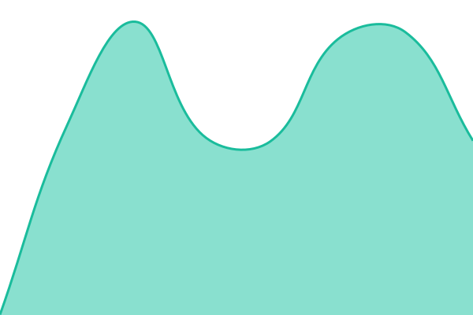
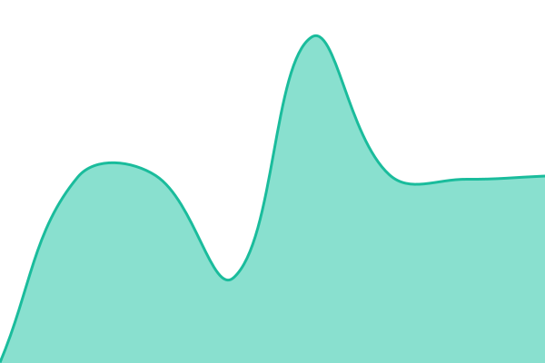
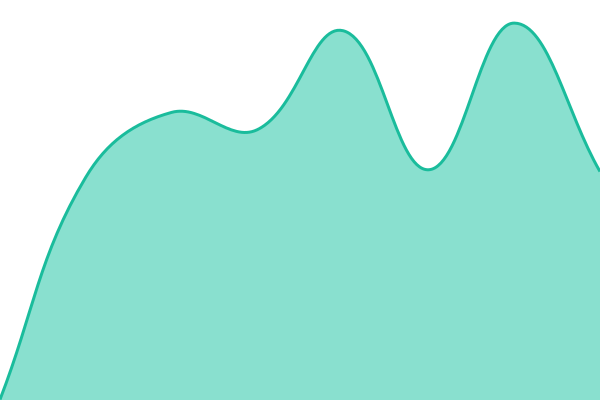

# [📈 Live Status](https://tjorim.github.io/upptime): <!--live status--> **🟩 All systems operational**

This repository contains the open-source uptime monitor and status page for [Jorim Tielemans](https://tjorim.github.io/upptime), powered by [Upptime](https://github.com/upptime/upptime).

With [Upptime](https://upptime.js.org), you can get your own unlimited and free uptime monitor and status page, powered entirely by a GitHub repository. We use [Issues](https://github.com/tjorim/upptime/issues) as incident reports, [Actions](https://github.com/tjorim/upptime/actions) as uptime monitors, and [Pages](https://tjorim.github.io/upptime) for the status page.

<!--start: status pages-->
<!-- This summary is generated by Upptime (https://github.com/upptime/upptime) -->
<!-- Do not edit this manually, your changes will be overwritten -->
<!-- prettier-ignore -->
| URL | Status | History | Response Time | Uptime |
| --- | ------ | ------- | ------------- | ------ |
|  [Champagne Festival](https://champagnefestival.tjor.im) | 🟩 Up | [champagne-festival.yml](https://github.com/tjorim/upptime/commits/HEAD/history/champagne-festival.yml) | 

 796ms
     
 | 

<a href="https://tjorim.github.io/upptime/history/champagne-festival">100.00%</a>
    

|  Champagne Festival API | 🟩 Up | [champagne-festival-api.yml](https://github.com/tjorim/upptime/commits/HEAD/history/champagne-festival-api.yml) | 

 443ms
     
 | 

<a href="https://tjorim.github.io/upptime/history/champagne-festival-api">100.00%</a>
    

|  Champagne Festival end-to-end | 🟩 Up | [champagne-festival-end-to-end.yml](https://github.com/tjorim/upptime/commits/HEAD/history/champagne-festival-end-to-end.yml) | 

 330ms
     
 | 

<a href="https://tjorim.github.io/upptime/history/champagne-festival-end-to-end">100.00%</a>
    

|  [Worktime](https://worktime.tjor.im) | 🟩 Up | [worktime.yml](https://github.com/tjorim/upptime/commits/HEAD/history/worktime.yml) | 

 641ms
     
 | 

<a href="https://tjorim.github.io/upptime/history/worktime">100.00%</a>
    

|  Worktime API | 🟩 Up | [worktime-api.yml](https://github.com/tjorim/upptime/commits/HEAD/history/worktime-api.yml) | 

 469ms
     
 | 

<a href="https://tjorim.github.io/upptime/history/worktime-api">100.00%</a>
    

|  [Daynest](https://daynest.tjor.im) | 🟩 Up | [daynest.yml](https://github.com/tjorim/upptime/commits/HEAD/history/daynest.yml) | 

 664ms
     
 | 

<a href="https://tjorim.github.io/upptime/history/daynest">100.00%</a>
    

|  Daynest API | 🟩 Up | [daynest-api.yml](https://github.com/tjorim/upptime/commits/HEAD/history/daynest-api.yml) | 

 417ms
     
 | 

<a href="https://tjorim.github.io/upptime/history/daynest-api">100.00%</a>
    

|  [Bordertax](https://bordertax.tjor.im) | 🟩 Up | [bordertax.yml](https://github.com/tjorim/upptime/commits/HEAD/history/bordertax.yml) | 

 670ms
     
 | 

<a href="https://tjorim.github.io/upptime/history/bordertax">100.00%</a>
    

|  Authentication | 🟩 Up | [authentication.yml](https://github.com/tjorim/upptime/commits/HEAD/history/authentication.yml) | 

 653ms
     
 | 

<a href="https://tjorim.github.io/upptime/history/authentication">100.00%</a>
    

<!--end: status pages-->

[**Visit our status website →**](https://tjorim.github.io/upptime)

## 📄 License

- Powered by: [Upptime](https://github.com/upptime/upptime)
- Code: [MIT](./LICENSE) © [Anand Chowdhary](https://anandchowdhary.com), supported by [Pabio](https://pabio.com)
- Data in the `./history` directory: [Open Database License](https://opendatacommons.org/licenses/odbl/1-0/)
